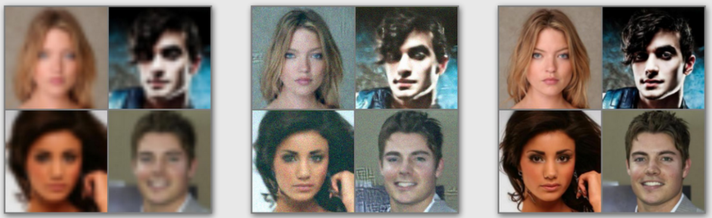
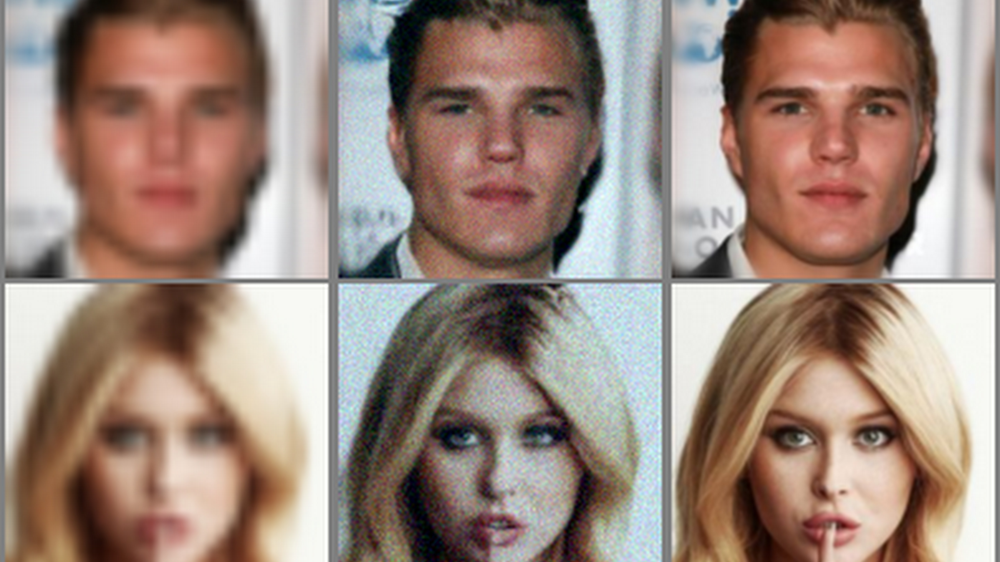
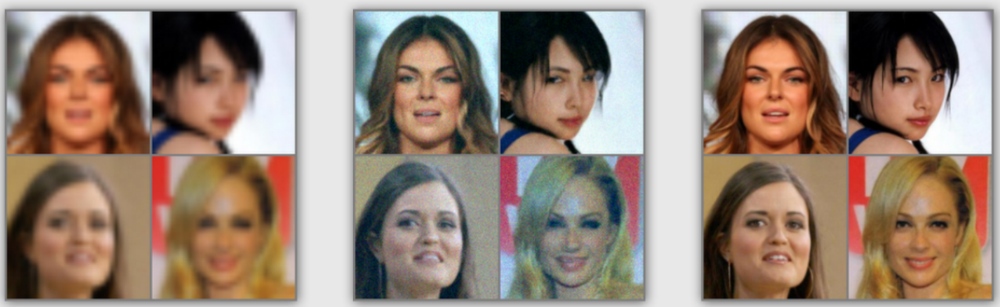

## Dependencies

This code is based on [Palette: Image-to-Image Diffusion Models](https://github.com/Janspiry/Palette-Image-to-Image-Diffusion-Models) and [pytorch-lightning-template](https://github.com/miracleyoo/pytorch-lightning-template).

+ pytorch-lightning-template is very easy and brief.
+ palette diffusion is just an example, base on this, I only run the sr model.

## Result on celeba dataset

## Pre-trained models
+ Because I don't have GPU resources and this is just a study project, so the training time of the above picture results is not long. If you want to use in paper or factory, you should refine the code and train.

